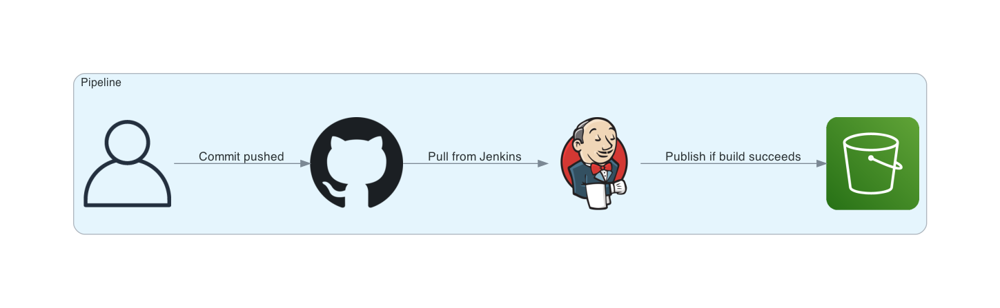

# Udacity - AWS S3 Static Website Deployment With Jenkins

Creating pipelines with Jenkins to support CICD

## About

This project shows how to set up a simple CICD pipeline with Jenkins on AWS to publish html pages to a static site hosted in S3.



## Getting Started

> Note: These instructions are a summary of the instructions of the project provided by Udacity.
This is my obligatory admission of liberal cribbing.

### Create an IAM Group and User to Manage Jenkins

Create an IAM Group with the following permissions or some subset of them specified for least privilege:
- AmazonEC2FullAccess
- AmazonVPCFullAccess
- AmazonS3FullAccess

Create an IAM User and assign them to that IAM Group. They can now manage EC2, VPCs, and S3.

### Create EC2 Instance
- Log in with the user from the previous step and create an EC2 Instance with Ubuntu 18.04 LTS amd64 and configure a security group to allow TCP on port 8080 and SSH.
- Connect to the instance through SSH.
- Run the following script to install Jenkins. Credit to Udacity for the setup instructions.

```SHELL
wget -q -O - https://pkg.jenkins.io/debian/jenkins.io.key | sudo apt-key add - && \
sudo sh -c 'echo deb http://pkg.jenkins.io/debian-stable binary/ > /etc/apt/sources.list.d/jenkins.list' && \
sudo apt update && \
sudo apt install default-jdk && \
sudo apt-get install -y tidy && \
sudo apt install jenkins && \
sudo systemctl status jenkins
```

- This should result in a confirmation that the service is running.
- Now run this to get the initial admin password needed to unlock Jenkins.

```SHELL
sudo cat /var/lib/jenkins/secrets/initialAdminPassword
```

- Create a Jenkins admin user when prompted.

### Configure Jenkins
Install the Jenkins plugins `BlueOcean aggregator` and `pipeline-aws`.

Restart Jenkins when they are installed by running the following:
```SHELL
sudo systemctl restart jenkins
```

### Create Pipeline and Link Jenkins to GitHub Repository
- Create a new pipeline with Blue Ocean. Select the GitHub option.

- Create an access key for Jenkins with the permissions specified here: [https://github.com/settings/tokens/new?scopes=repo,read:user,user:email,write:repo_hook](https://github.com/settings/tokens/new?scopes=repo,read:user,user:email,write:repo_hook)

- That access key will be used by Jenkins to retrieve the repository where this pipeline is stored through the GitHub API.

- Enter that access key into Blue Ocean in Jenkins and then select the appropriate account and then repository.

- Now, when Jenkins registers that there are changes in the repository, it will run a build.

### Configure AWS Credentials

- In Jenkins, select `Credentials` and add `AWS Credentials`.
- Note the id for the credentials that you create, since it will need to be referenced by the Jenkins build.

### Configure an S3 Bucket
- Create an S3 bucket.
- Configure the S3 bucket for static site hosting.
- The following permissions can be set on the bucket to get started.

```JSON
{
    "Version": "2012-10-17",
    "Statement": [
        {
            "Sid": "PublicReadGetObject",
            "Effect": "Allow",
            "Principal": "*",
            "Action": "s3:GetObject",
            "Resource": "arn:aws:s3:::<BUCKET_NAME>/*"
        }
    ]
}
```

### Update Jenkinsfile with S3 Bucket Info
- Update the region and the bucket identifier in the Jenkinsfile to match the new bucket you created.

Now you should be off to the races! Customize away from here.

## References

- Udacity
    - [Udacity Cloud DevOps Nanodegree](https://www.udacity.com/course/cloud-dev-ops-nanodegree--nd9991)
    - [Udacity Nanodegree Git Style Guide](https://udacity.github.io/git-styleguide/)
- Jenkins
    - [Home](https://www.jenkins.io/)
    - [Pipelines](https://www.jenkins.io/doc/book/pipeline/)
    - [withAWS](https://github.com/jenkinsci/pipeline-aws-plugin#withaws)
    - [s3Upload](https://github.com/jenkinsci/pipeline-aws-plugin#s3upload)
- Release Types
    - Canary
        - [Martin Fowler - Canary Release](https://martinfowler.com/bliki/CanaryRelease.html)
        - [Hussein Nasser - Canary Deployment (Explained by Example)](https://www.youtube.com/watch?v=3IJ5ko8jSIA)
    - Blue/Green
        - [AWS Architectures - Blue/Green](https://aws.amazon.com/quickstart/architecture/blue-green-deployment/)
